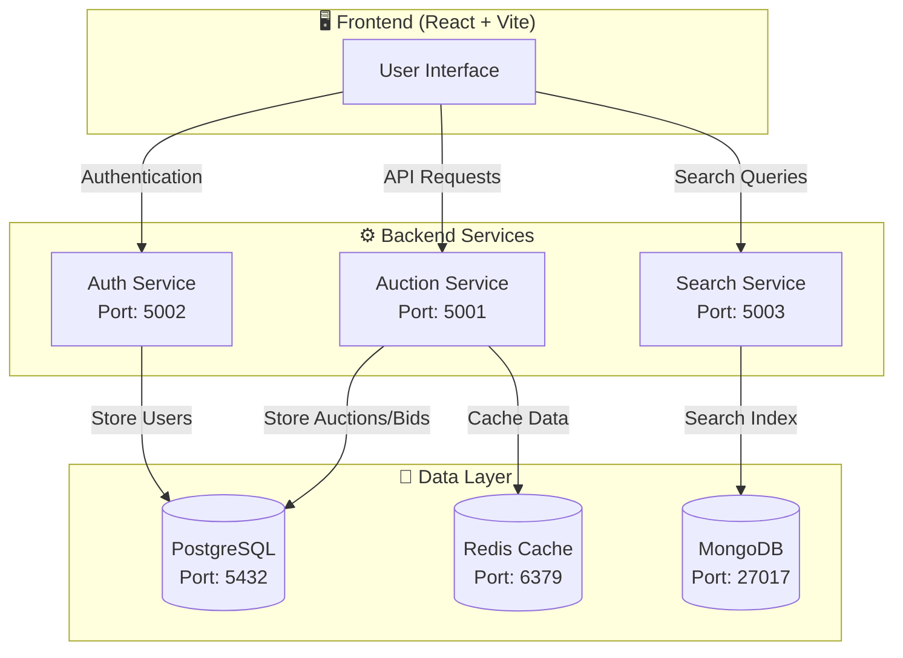
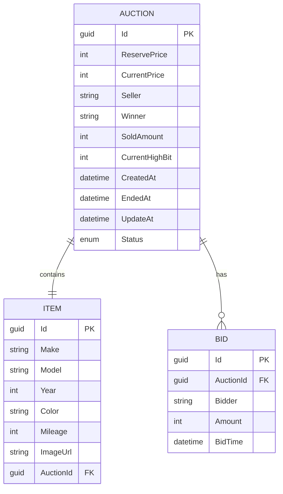
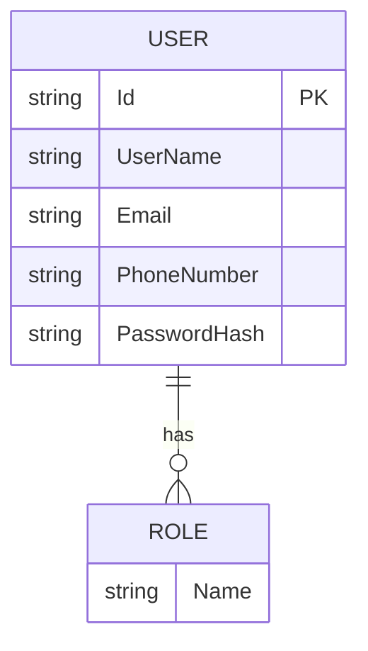
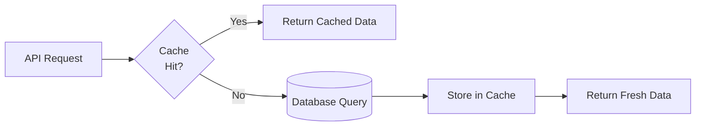

# 🚗 Carsties - Car Auction Platform

<div align="center">


**A modern, full-stack car auction platform built with microservices architecture**

[Features](#-features) • [Architecture](#-architecture) • [Getting Started](#-getting-started) • [API Reference](#-api-reference) • [Tech Stack](#-tech-stack)

</div>

---

## ✨ Features

- 🔐 **Secure Authentication** - JWT-based auth with OTP support for login/password reset
- 🎯 **Role-Based Access** - Separate roles for Bidders, Auctioneers, or Both
- 🚀 **Real-Time Bidding** - Place bids on live car auctions
- ⚡ **Redis Caching** - High-performance caching for optimal speed
- 🔍 **Search Service** - MongoDB-powered search functionality
- 🎨 **Modern UI** - React frontend with Framer Motion animations

---

## 🏗 Architecture

```
┌─────────────────────────────────────────────────────────────────────────────┐
│                              CARSTIES PLATFORM                              │
└─────────────────────────────────────────────────────────────────────────────┘

┌─────────────────┐     ┌─────────────────┐      ┌─────────────────┐
│                 │     │                 │      │                 │
│  React Frontend │────▶│  Auction Service│────▶│   PostgreSQL    │
│     (Vite)      │     │   (.NET 8.0)    │      │    Database     │
│   Port: 5173    │     │   Port: 5001    │      │   Port: 5432    │
│                 │     │                 │      │                 │
└─────────────────┘     └────────┬────────┘      └─────────────────┘
                                 │
                                 │
                        ┌────────▼────────┐
                        │                 │
                        │   Redis Cache   │
                        │   Port: 6379    │
                        │                 │
                        └─────────────────┘

┌─────────────────┐     ┌─────────────────┐     ┌─────────────────┐
│                 │     │                 │     │                 │
│  React Frontend │────▶│   Auth Service  │────▶│   PostgreSQL    │
│     (Vite)      │     │   (.NET 8.0)    │     │    (AuthDB)     │
│   Port: 5173    │     │   Port: 5002    │     │   Port: 5432    │
│                 │     │                 │     │                 │
└─────────────────┘     └─────────────────┘     └─────────────────┘

┌─────────────────┐     ┌─────────────────┐
│                 │     │                 │
│  Search Client  │────▶│  Search Service │────▶│    MongoDB      │
│                 │     │   (.NET 8.0)    │     │   Port: 27017   │
└─────────────────┘     └─────────────────┘     └─────────────────┘
```

### Service Communication Flow



---

## 📁 Project Structure

```
carsties/
├── 📁 src/
│   ├── 📁 AuctionService/         # Main auction & bidding API
│   │   ├── Controllers/           # API endpoints
│   │   │   ├── AuctionsController.cs
│   │   │   ├── BidsController.cs
│   │   │   └── CacheController.cs
│   │   ├── Data/                  # Database context & migrations
│   │   ├── Dtos/                  # Data transfer objects
│   │   ├── Entities/              # Domain models
│   │   └── Services/              # Business logic & caching
│   │
│   ├── 📁 AuthenticationService/  # User authentication API
│   │   ├── Controllers/           # Auth endpoints
│   │   ├── Dtos/                  # Auth DTOs
│   │   ├── Entities/              # User entities
│   │   └── Services/              # Token & OTP services
│   │
│   └── 📁 SearchService/          # Search functionality
│       └── Models/                # Search models
│
├── 📁 frontend/                   # React application
│   ├── src/
│   │   ├── components/            # Reusable UI components
│   │   ├── context/               # React context providers
│   │   └── pages/                 # Page components
│   └── package.json
│
├── 📄 docker-compose.yml          # Container orchestration
├── 📄 run-all.ps1                 # Full stack launcher script
└── 📄 carsties.sln                # .NET solution file
```

---

## 🚀 Getting Started

### Prerequisites

Ensure you have the following installed:

| Tool               | Version | Download                                                   |
| ------------------ | ------- | ---------------------------------------------------------- |
| **.NET SDK**       | 8.0+    | [Download](https://dotnet.microsoft.com/download)          |
| **Node.js**        | 18.0+   | [Download](https://nodejs.org/)                            |
| **Docker Desktop** | Latest  | [Download](https://www.docker.com/products/docker-desktop) |

### Quick Start (Recommended)

The easiest way to run the entire stack is using the PowerShell launcher script:

```powershell
# Clone the repository
git clone https://github.com/yourusername/carsties.git
cd carsties

# Run everything with one command
.\run-all.ps1
```

This script will:

1. ✅ Start Docker containers (PostgreSQL, Redis, MongoDB)
2. ✅ Wait for services to be ready
3. ✅ Build and run Authentication Service
4. ✅ Build and run Auction Service
5. ✅ Install npm packages and start Frontend

### Manual Setup

If you prefer to run services individually:

#### Step 1: Start Docker Services

```powershell
# Start all database containers
docker-compose up -d
```

This starts:

- **PostgreSQL** on port `5432`
- **MongoDB** on port `27017`
- **Redis** on port `6379`

#### Step 2: Run Authentication Service

```powershell
cd src/AuthenticationService
dotnet restore
dotnet build
dotnet run
```

The Auth service will start on `http://localhost:5002`

#### Step 3: Run Auction Service

```powershell
cd src/AuctionService
dotnet restore
dotnet build
dotnet run
```

The Auction service will start on `http://localhost:5001`

#### Step 4: Run Frontend

```powershell
cd frontend
npm install
npm run dev
```

The frontend will start on `http://localhost:5173`

### Stopping Services

```powershell
# Stop Docker containers
docker-compose down

# To also remove volumes (data will be lost)
docker-compose down -v
```

---

## 📊 Data Models

### Auction Entity



### User Entity



---

## 📡 API Reference

### Authentication Endpoints

| Method | Endpoint                    | Description             | Auth |
| ------ | --------------------------- | ----------------------- | ---- |
| `POST` | `/api/Auth/register`        | Create new user account | ❌   |
| `POST` | `/api/Auth/login`           | Login with credentials  | ❌   |
| `POST` | `/api/Auth/send-otp`        | Send OTP to email/phone | ❌   |
| `POST` | `/api/Auth/login-with-otp`  | Login using OTP         | ❌   |
| `POST` | `/api/Auth/forgot-password` | Initiate password reset | ❌   |
| `POST` | `/api/Auth/reset-password`  | Reset password with OTP | ❌   |
| `GET`  | `/api/Auth`                 | Get current user info   | ✅   |

### Auction Endpoints

| Method | Endpoint                    | Description        | Auth          |
| ------ | --------------------------- | ------------------ | ------------- |
| `GET`  | `/api/Auctions`             | Get all auctions   | ❌            |
| `GET`  | `/api/Auctions/{id}`        | Get auction by ID  | ❌            |
| `POST` | `/api/Auctions`             | Create new auction | ✅ Auctioneer |
| `POST` | `/api/Auctions/update/{id}` | Update auction     | ✅            |
| `POST` | `/api/Auctions/delete/{id}` | Delete auction     | ✅            |

### Bid Endpoints

| Method | Endpoint                        | Description          | Auth      |
| ------ | ------------------------------- | -------------------- | --------- |
| `GET`  | `/api/Bids/auction/{auctionId}` | Get bids for auction | ❌        |
| `GET`  | `/api/Bids/highest/{auctionId}` | Get highest bid      | ❌        |
| `POST` | `/api/Bids`                     | Place a bid          | ✅ Bidder |

### Cache Management

| Method   | Endpoint            | Description        | Auth |
| -------- | ------------------- | ------------------ | ---- |
| `GET`    | `/api/Cache/status` | Check cache health | ❌   |
| `DELETE` | `/api/Cache/clear`  | Clear all cache    | ✅   |

---

## 🛠 Tech Stack

### Backend

| Technology                | Purpose               |
| ------------------------- | --------------------- |
| **.NET 8.0**              | Web API framework     |
| **Entity Framework Core** | ORM for PostgreSQL    |
| **ASP.NET Identity**      | User management       |
| **AutoMapper**            | Object mapping        |
| **JWT Bearer**            | Authentication tokens |

### Frontend

| Technology        | Purpose     |
| ----------------- | ----------- |
| **React 19**      | UI library  |
| **Vite**          | Build tool  |
| **Framer Motion** | Animations  |
| **React Router**  | Navigation  |
| **Axios**         | HTTP client |

### Infrastructure

| Technology        | Purpose                 |
| ----------------- | ----------------------- |
| **PostgreSQL 15** | Primary database        |
| **MongoDB**       | Search service database |
| **Redis 7**       | Distributed caching     |
| **Docker**        | Containerization        |

---

## ⚡ Redis Caching

The platform implements Redis caching for improved performance:

### Cache Strategy



### Cache Keys

| Key Pattern    | Description       | TTL    |
| -------------- | ----------------- | ------ |
| `auctions:all` | All auctions list | 30 min |
| `auction:{id}` | Single auction    | 30 min |

### Cache Invalidation

Cache is automatically invalidated when:

- New auction is created
- Auction is updated
- Auction is deleted

---

## 🔐 User Roles

| Role           | Create Auction | Place Bid |
| -------------- | -------------- | --------- |
| **Bidder**     | ❌             | ✅        |
| **Auctioneer** | ✅             | ❌        |
| **Both**       | ✅             | ✅        |

---

## 📝 Environment Variables

### AuctionService (`appsettings.json`)

```json
{
  "ConnectionStrings": {
    "DefaultConnection": "Server=localhost:5432;Database=auctiondb;User Id=postgres;Password=postgrespw",
    "Redis": "localhost:6379"
  },
  "TokenKey": "your-super-long-secret-key-minimum-64-characters"
}
```

### AuthenticationService (`appsettings.json`)

```json
{
  "ConnectionStrings": {
    "DefaultConnection": "Server=localhost:5432;Database=authdb;User Id=postgres;Password=postgrespw"
  },
  "TokenKey": "your-super-long-secret-key-minimum-64-characters"
}
```

---

## 🧪 Testing

### Test Cache Functionality

```powershell
# Run the cache test script
.\test-cache.ps1
```

### API Testing

Use the `.http` files included in each service for quick API testing:

- `src/AuctionService/AuctionService.http`
- `src/AuthenticationService/AuthenticationService.http`
- `src/SearchService/SearchService.http`

---

## 📖 Additional Documentation

- [Redis Caching Implementation](./REDIS_IMPLEMENTATION.md)
- [Redis Caching Guide](./REDIS_CACHING.md)

---

## 🤝 Contributing

1. Fork the repository
2. Create a feature branch (`git checkout -b feature/amazing-feature`)
3. Commit your changes (`git commit -m 'Add amazing feature'`)
4. Push to the branch (`git push origin feature/amazing-feature`)
5. Open a Pull Request

---

## 📄 License

This project is licensed under the MIT License - see the [LICENSE](LICENSE) file for details.

---

<div align="center">

**Made with ❤️ by Shivendra**

</div>
